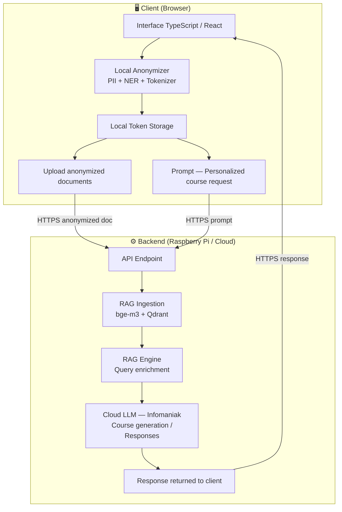

# LuminaSwiss — Knowledge-to-Learning Engine

LuminaSwiss is a secure, private, RAG-driven knowledge management system designed to transform internal documentation into intelligent training modules.
The project was realized during the Devpost genAI Zurich 2026 Hackathon, it is not intended for production.

## Idea

Lumina Swiss is a privacy-first Learning Management System designed for organizations that want full control over their data. Built with a "Privacy-First" architecture, it detects and anonymizes PII (Personally Identifiable Information) on the client side and send data to a personalized cloud infrastructure ensuring sensitive information never leaves the organization unprotected. The platform leverages this secure knowledge base to generate personalized training courses tailored to each organization's content and needs. Built entirely on Swiss infrastructure — with API calls routed through Infomaniak and end-to-end encrypted communications — Lumina Swiss guarantees data sovereignty and regulatory compliance. The modular architecture is designed to scale beyond a single organization.

## Architecture



## Submission & Deployment
LuminaSwiss is designed for deployment on local infrastructure and with Swiss base solution LLMs (e.g., Infomaniak Jelastic/Public Cloud).
- **Frontend**: Static build deployed to a web server or CDN.
- **Backend**: Python app served via Uvicorn
- **Database**: Persistent SQLite volume

## Security & Privacy
- **Client-Side PII Detection**: Uses a local Transformers.js model to detect sensitive data (names, locations, etc.).
- **Tokenization**: Sensitive data is replaced by tokens (e.g., `[[PII_001]]`) before upload.
- **RAG-First**: All LLM queries are grounded in your private, anonymized document base.

## Requirements

### Client
- **Node** (v22+)

### Server
- **Python** (v3.11+)
- **Docker** (v29.0+)
- **Ubuntu-server 24.04 or Debian Bookworm**
- **Infomaniak LLM API token Key**


## Quick installation

See README.md in server and client folders for detailed information

### Server

```bash
cd ./server
bash install-requirements.sh
```

### Client

```bash
cd ./client
npm install
nom run dev
```

**Testing Request**: Please test the LLMs prompt and courses generation in either **English** or **French**.