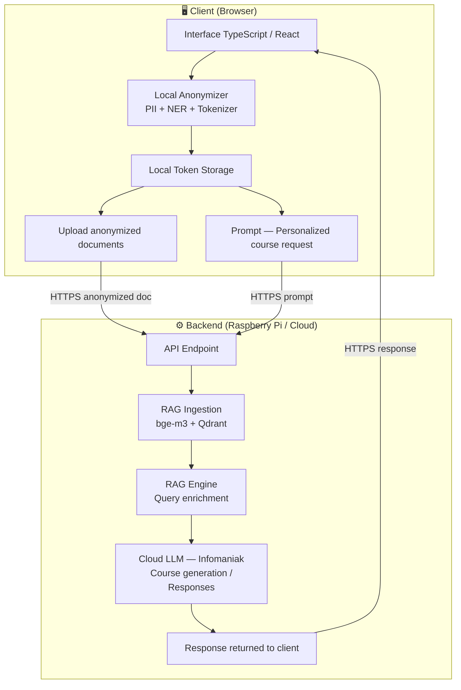

# LuminaSwiss — Knowledge-to-Learning Engine

LuminaSwiss is a secure, private, RAG-driven knowledge management system designed to transform internal documentation into intelligent training modules.
The project was realized during the Devpost genAI Zurich 2026 Hackathon, it is not intended for production.

## Idea

Lumina Swiss is a privacy-first Learning Management System designed for organizations that want full control over their data. Built with a "Privacy-First" architecture, it detects and anonymizes PII (Personally Identifiable Information) on the client side and send data to a personalized cloud infrastructure ensuring sensitive information never leaves the organization unprotected. The platform leverages this secure knowledge base to generate personalized training courses tailored to each organization's content and needs. Built entirely on Swiss infrastructure — with API calls routed through Infomaniak and end-to-end encrypted communications — Lumina Swiss guarantees data sovereignty and regulatory compliance. The modular architecture is designed to scale beyond a single organization.

## Architecture



## Submission & Deployment
LuminaSwiss is designed for deployment on local infrastructure and with Swiss base solution LLMs (e.g., Infomaniak Jelastic/Public Cloud).
- **Frontend**: Static build deployed to a web server or CDN.
- **Backend**: Python app served via Uvicorn
- **Database**: Persistent SQLite volume

## Security & Privacy
- **Client-Side PII Detection**: Uses a local Transformers.js model to detect sensitive data (names, locations, etc.).
- **Tokenization**: Sensitive data is replaced by tokens (e.g., `[[PII_001]]`) before upload.
- **RAG-First**: All LLM queries are grounded in your private, anonymized document base.

## Requirements

### Client
- **Preferably Linux distro (Ubuntu, Debian...) or WSL**
- **Node** (v22+)

### Server
- **Debian Bookworm or WSL for Windows users**
- **Python** (v3.11+)
- **Docker** (v29.0+)
- **Port Availability**: Ensure ports **8000** (Backend) and **8080** (Frontend) are not being used by other applications.
- **Infomaniak LLM API token Key**

## Quick installation

### Server

```bash
cd ./server
bash install.sh
```

### Client

```bash
cd ./client
npm install
npm run dev  # or : npm run dev:cloud      if you only want to test the client with lumina backend cloud
```

## 1. Detailed installation steps

This guide provides the necessary steps to correctly configure and test the Lumina Swiss system in a local environment or test the client with our deployed backend on the cloud.

## 2. Environment Configuration (`.env`)

### Backend (`server/.env`)
If you test the client with Lumina cloud infrastructure you can skip this step. But feel free to reach us on discord to so we can create a user account to access LLM prompt and LMS courses generation.
Ensure valid API keys for Infomaniak or OpenAI are provided to enable AI features. An example of the .env below :

```bash
cd server && docker compose down -v
```

**Create a .env file in server/**
```bash
# .env
INFOMANIAK_API_KEY=your_infomaniak_api_key_here
INFOMANIAK_PRODUCT_ID=your_product_id_here
INFOMANIAK_MODEL=llama3  # Available models: mistral3, llama3, mistral3, etc.
CORS_ORIGINS=allowed-frontend-url-origins # default: http://localhost:8080
CADDY_HOST=localhost  # default: localhost, change to it to http://[SERVER-IP] if you are not executing the server locally
```

**Launch server for the first time by launching in server/ :**
```bash
docker compose up --build -d
```
The server might takes several minutes before being up and running.
---

### Frontend (`client/.env`)
The choice of `VITE_API_URL` is critical for successful communication:
- **Same-machine testing**: Set `VITE_API_URL=http://localhost:8000` (or leave empty).
- **Remote local Network testing**: Set `VITE_API_URL` to the machine hosting the server (e.g., `http://192.168.1.XX:8000`).
- **Client test with Lumina cloud infrastracture**: Set `VITE_API_URL=lumina-swiss.cloud`


## 3. Recommended Testing Workflow

### Document Processing
- **Large Files (Up to 20MB)**: The system is optimized for massive documents. When uploading, look for the **real-time progress percentage** in the document list.
- **Hardware Acceleration**: For the fastest PII detection, use a modern browser (Chrome/Edge/Safari) with **Hardware Acceleration** enabled in settings.

### AI Course Generation
- **Generation Time**: Complex course generation involves deep RAG analysis and can take **1 to 3 minutes**. 
- **Language**: The AI automatically inherits your UI language (French, Italian, German, Romansh). 

### Evaluation & Quizzes
- **Progress Tracking**: The quiz progress bar updates specifically when a question is **answered**. It reaches 100% only upon completion of the final question.

---

## 4. System Shutdown
To safely stop all services and preserve resources:
1. Stop the frontend terminal (`Ctrl + C`).
2. Stop the backend: 
```bash
cd server && docker compose down
```


**Testing Request**: Please test the LLMs prompt and courses generation in either **English** or **French**.